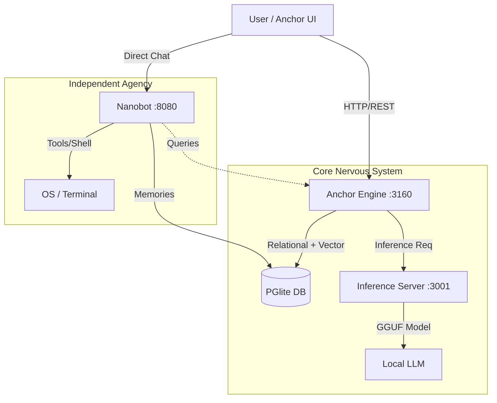
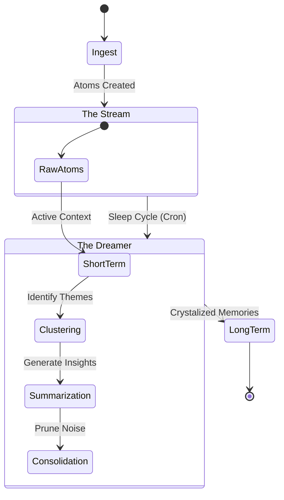

# Anchor OS - Unified Launcher

Welcome to the Anchor OS ecosystem! This repository contains a service-oriented architecture with multiple interconnected components.

## Architecture Overview

- **anchor-engine**: Knowledge database engine (runs on port 3160)
- **inference-server**: Standalone inference server (runs on port 3001)
- **anchor-ui**: React frontend interface (runs on port 5173 in dev)
- **nanobot-node**: Lightweight agent service (runs on port 8080)
- **@rbalchii/native-vector**: High-performance semantic search module (C++ Addon)

## Architecture Diagrams

### 1. System Ecosystem (Split-Brain)


### 2. Ingestion Pipeline (The Atomizer)
```mermaid
graph LR
    File[Markdown/Text File] -->|Watchdog Detects| Atomizer
    Atomizer -->|Split| Molecules[Molecules (Context Blocks)]
    Molecules -->|Split| Atoms[Atoms (Entities/Paragraphs)]
    
    subgraph "Enrichment"
        Atoms -->|NLP| Entities[Named Entities]
        Atoms -->|SimHash| Dedup[Deduplication]
        Atoms -->|Embedding| Vectors[Vector Embeddings]
    end
    
    Vectors --> DB[(Anchor DB)]
```

### 3. Memory Cycle (Stream to Insight)


## Configuration

All services share a centralized configuration located at `./user_settings.json`. This single configuration file controls settings for all services in the ecosystem:

- **Server settings** (ports, hosts)
- **LLM settings** (models, paths, GPU layers, context sizes)
- **Search settings** (strategies, limits)
- **Resource management** (garbage collection, memory limits)
- **Service settings** (ports, timeouts)
- **Limits** (file sizes, content lengths)

## Quick Start

To launch all services at once, run:

**On Windows:**
```bash
start.bat
```

**On Unix/Linux/macOS:**
```bash
./start.sh
```

This will:
1. Install dependencies if needed
2. Start all services in separate terminals
3. Route logs to the `./logs/` directory
4. Apply log rotation to maintain performance
5. Use the centralized configuration from `./user_settings.json`

## Logging Configuration

Logging behavior can be controlled via the `logging` section in `user_settings.json`:

```json
{
  "logging": {
    "enabled": true,
    "log_directory": "./logs",
    "max_lines_per_file": 10000,
    "services": {
      "anchor_engine": {
        "enabled": true,
        "log_file": "anchor_engine.log"
      },
      "inference_server": {
        "enabled": true,
        "log_file": "inference_server.log"
      },
      "anchor_ui": {
        "enabled": false,
        "log_file": "anchor_ui.log"
      },
      "nanobot_node": {
        "enabled": true,
        "log_file": "nanobot_node.log"
      }
    }
  }
}
```

## Individual Service Management

If you need to run services individually:

**On Windows:**
```bash
# From the root directory
cd packages/anchor-engine && pnpm start
cd packages/inference-server && pnpm start
cd packages/anchor-ui && pnpm dev
cd packages/nanobot-node && pnpm start
```

**On Unix/Linux/macOS:**
```bash
# From the root directory
cd packages/anchor-engine && pnpm start
cd packages/inference-server && pnpm start
cd packages/anchor-ui && pnpm dev
cd packages/nanobot-node && pnpm start
```

Or with logging:

**On Windows:**
```bash
# From the root directory
cd packages/anchor-engine && pnpm run start-with-logging
cd packages/inference-server && pnpm run start-with-logging
cd packages/anchor-ui && pnpm run start-with-logging
cd packages/nanobot-node && pnpm run start-with-logging
```

**On Unix/Linux/macOS:**
```bash
# From the root directory
cd packages/anchor-engine && pnpm run start-with-logging
cd packages/inference-server && pnpm run start-with-logging
cd packages/anchor-ui && pnpm run start-with-logging
cd packages/nanobot-node && pnpm run start-with-logging
```

## Logs Management

Logs are stored in the `./logs/` directory and automatically rotated to maintain the last 10,000 lines per file. You can manually run the rotation script:

**On Windows:**
```bash
powershell -ExecutionPolicy Bypass -File "scripts\rotate-logs.ps1"
```

**On Unix/Linux/macOS:**
```bash
bash scripts/rotate-logs.sh
```

## Ports

- **3160**: Anchor Engine (Knowledge Database)
- **3001**: Inference Server (AI Processing)
- **5173**: Anchor UI (Development Server)

## Troubleshooting

If services fail to start:
1. Ensure Node.js v18+ and PNPM are installed
2. Run `pnpm install` in the root directory
3. Check the logs in the `./logs/` directory
4. Verify ports 3000 and 3001 are not in use by other applications
5. Ensure the `./user_settings.json` file exists and has valid configuration