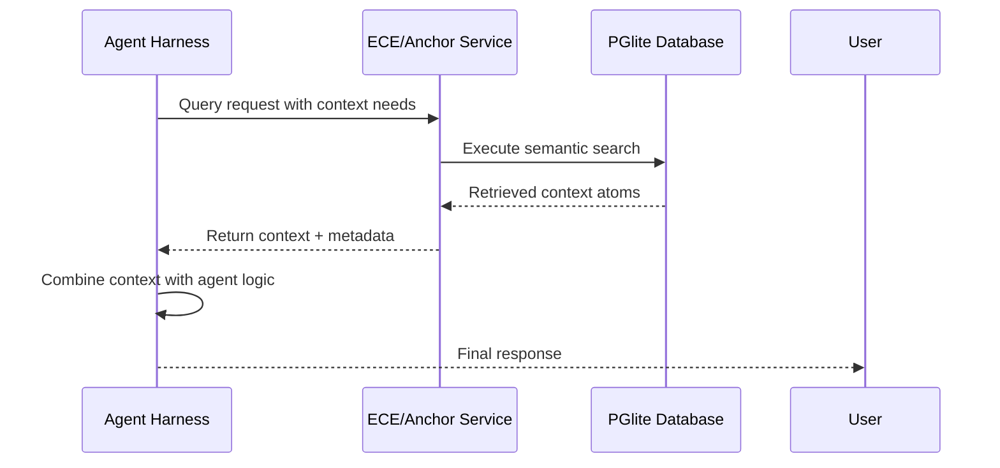

# Agent Harness Integration Patterns

## Overview

The ECE_Core system is designed to be **agent harness agnostic**, allowing multiple agent frameworks to integrate with the core data atomization service. This document outlines the integration patterns for connecting agent harnesses to the ECE system.

## Core Philosophy: Data Atomization Service

ECE/Anchor is fundamentally a **data atomization service** that:

- Packages diverse data types into semantically meaningful units
- Enables semantic utilization of multiple data types
- Provides API access for querying and parsing data
- Outputs data in standardized formats (JSON, CSV, tables)
- Serves as a foundational layer for various agent systems

## Integration Patterns

### 1. Stateless Context Retrieval Pattern

The recommended approach for agent harness integration is the stateless context retrieval pattern:



**Benefits:**
- No session memory dependencies
- Consistent context retrieval
- Scalable across multiple agent instances
- Predictable performance characteristics

### 2. API-Based Integration Pattern

Agent harnesses should use the standardized API endpoints:

#### Context Retrieval
```
POST /v1/memory/search
{
  "query": "natural language query",
  "buckets": ["optional", "bucket", "filters"],
  "tags": ["optional", "tag", "filters"],
  "max_chars": 20000
}
```

#### Molecule Search (Sentence-like chunks)
```
POST /v1/memory/molecule-search
{
  "query": "query split into sentence-like chunks",
  "max_chars": 2400
}
```

#### Data Management
```
GET /v1/buckets - Get available data buckets
GET /v1/tags - Get available tags
POST /v1/ingest - Ingest new content
```

### 3. Token Budget Management Pattern

Agent harnesses should implement token budget management:

```typescript
interface ContextRequest {
  query: string;
  tokenBudget?: number; // Maximum tokens to retrieve
  provenance?: 'internal' | 'external' | 'all'; // Data source filtering
  buckets?: string[]; // Optional bucket filters
  tags?: string[]; // Optional tag filters
}
```

### 4. Fallback and Error Handling Pattern

Implement robust fallback mechanisms:

```typescript
async function getContextWithFallback(query: string) {
  try {
    // Primary search
    const results = await eceApi.search({
      query,
      max_chars: 20000
    });
    return results;
  } catch (primaryError) {
    console.warn('Primary search failed, trying fallback:', primaryError);
    
    // Fallback search with relaxed parameters
    try {
      const fallbackResults = await eceApi.search({
        query,
        max_chars: 10000, // Reduced budget
        buckets: [], // Remove bucket filters
        tags: [] // Remove tag filters
      });
      return fallbackResults;
    } catch (fallbackError) {
      console.error('Both primary and fallback searches failed:', fallbackError);
      return { context: '', results: [] }; // Safe fallback
    }
  }
}
```

## OpenCLAW Integration Example

As the primary target harness, OpenCLAW follows these integration patterns:

### 1. Context Injection
- OpenCLAW sends user queries to `/v1/memory/search`
- Retrieved context is injected into the LLM prompt
- Response combines ECE context with OpenCLAW's reasoning

### 2. State Management
- OpenCLAW maintains its own session state
- ECE provides context without session memory
- Clean separation of concerns

### 3. Performance Optimization
- OpenCLAW implements caching for repeated queries
- Token budgets are managed per interaction
- Asynchronous context retrieval to avoid blocking

## Generic Agent Harness Template

For developing new agent harnesses, use this template:

```typescript
class GenericAgentHarness {
  private eceEndpoint: string;
  private tokenBudget: number;
  
  constructor(eceEndpoint: string, tokenBudget: number = 20000) {
    this.eceEndpoint = eceEndpoint;
    this.tokenBudget = tokenBudget;
  }
  
  async processQuery(userQuery: string) {
    // 1. Retrieve context from ECE
    const context = await this.retrieveContext(userQuery);
    
    // 2. Combine context with agent logic
    const fullPrompt = this.constructPrompt(userQuery, context);
    
    // 3. Process with agent's own logic
    const response = await this.processWithAgent(fullPrompt);
    
    return response;
  }
  
  private async retrieveContext(query: string) {
    const response = await fetch(`${this.eceEndpoint}/v1/memory/search`, {
      method: 'POST',
      headers: { 'Content-Type': 'application/json' },
      body: JSON.stringify({
        query,
        max_chars: this.tokenBudget
      })
    });
    
    return response.json();
  }
  
  private constructPrompt(userQuery: string, context: any) {
    return `Context:\n${context.context}\n\nQuestion: ${userQuery}`;
  }
  
  private async processWithAgent(prompt: string) {
    // Agent-specific processing logic
    // This is where the agent's unique logic applies
  }
}
```

## Best Practices

### 1. Error Resilience
- Always implement fallback strategies
- Handle network errors gracefully
- Provide meaningful error messages to users

### 2. Performance Optimization
- Implement caching for repeated queries
- Use appropriate token budgets
- Consider asynchronous retrieval to avoid blocking

### 3. Security Considerations
- Validate all inputs before sending to ECE
- Implement rate limiting if needed
- Secure communication channels

### 4. Monitoring and Logging
- Log context retrieval performance
- Monitor success rates of queries
- Track token usage patterns

## Future Extensions

### Plugin Architecture
Future versions may include a plugin system for dynamic agent harness loading:

```typescript
interface AgentPlugin {
  name: string;
  initialize(): Promise<void>;
  processQuery(query: string, context: any): Promise<any>;
  cleanup(): Promise<void>;
}
```

This pattern ensures that ECE/Anchor remains a robust, flexible foundation for various agent systems while maintaining clean separation of concerns between the data atomization service and agent-specific logic.