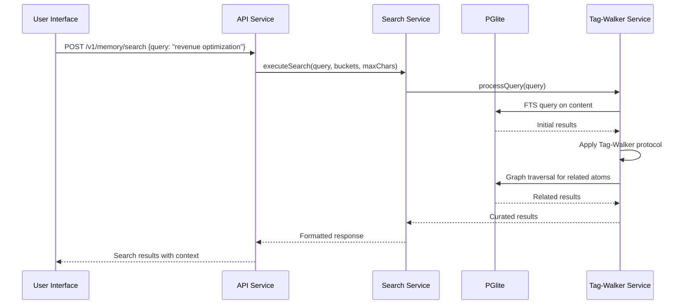
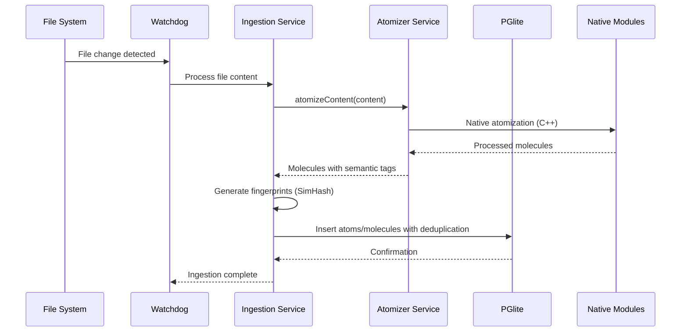
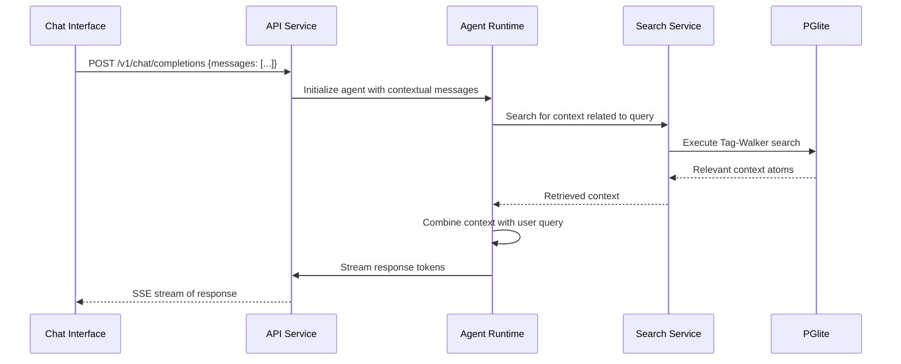
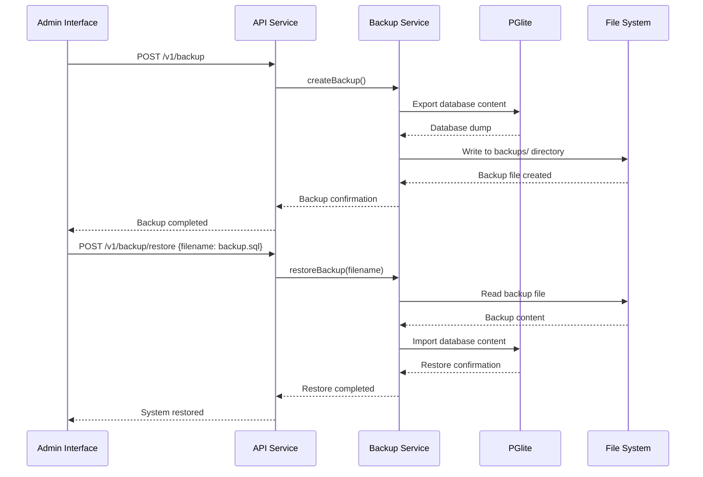
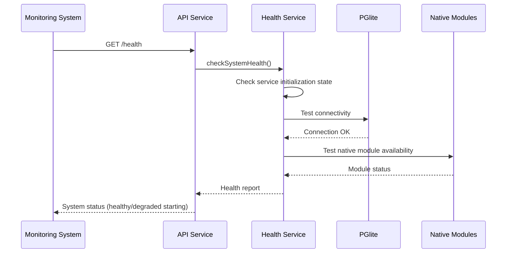

# API Flow Diagrams for ECE_Core

## Search Flow

```mermaid
sequenceDiagram
    participant UI as User Interface
    participant API as API Service
    participant SS as Search Service
    participant DB as PGlite
    participant TS as Tag-Walker Service

    UI->>API: POST /v1/memory/search {query: "revenue optimization"}
    API->>SS: executeSearch(query, buckets, maxChars)
    SS->>TS: processQuery(query)
    TS->>DB: FTS query on content
    DB-->>TS: Initial results
    TS->>TS: Apply Tag-Walker protocol
    TS->>DB: Graph traversal for related atoms
    DB-->>TS: Related results
    TS-->>SS: Curated results
    SS-->>API: Formatted response
    API-->>UI: Search results with context
```

## Ingestion Flow

```mermaid
sequenceDiagram
    participant FS as File System
    participant WD as Watchdog
    participant IS as Ingestion Service
    participant AS as Atomizer Service
    participant DB as PGlite
    participant NM as Native Modules

    FS->>WD: File change detected
    WD->>IS: Process file content
    IS->>AS: atomizeContent(content)
    AS->>NM: Native atomization (C++)
    NM-->>AS: Processed molecules
    AS-->>IS: Molecules with semantic tags
    IS->>IS: Generate fingerprints (SimHash)
    IS->>DB: Insert atoms/molecules with deduplication
    DB-->>IS: Confirmation
    IS-->>WD: Ingestion complete
```

## Chat Flow with Context Injection

```mermaid
sequenceDiagram
    participant UI as Chat Interface
    participant API as API Service
    participant AR as Agent Runtime
    participant SS as Search Service
    participant DB as PGlite

    UI->>API: POST /v1/chat/completions {messages: [...]}
    API->>AR: Initialize agent with contextual messages
    AR->>SS: Search for context related to query
    SS->>DB: Execute Tag-Walker search
    DB-->>SS: Relevant context atoms
    SS-->>AR: Retrieved context
    AR->>AR: Combine context with user query
    AR->>API: Stream response tokens
    API-->>UI: SSE stream of response
```

## Backup/Restore Flow

```mermaid
sequenceDiagram
    participant UI as Admin Interface
    participant API as API Service
    participant BS as Backup Service
    participant DB as PGlite
    participant FS as File System

    UI->>API: POST /v1/backup
    API->>BS: createBackup()
    BS->>DB: Export database content
    DB-->>BS: Database dump
    BS->>FS: Write to backups/ directory
    FS-->>BS: Backup file created
    BS-->>API: Backup confirmation
    API-->>UI: Backup completed

    UI->>API: POST /v1/backup/restore {filename: backup.sql}
    API->>BS: restoreBackup(filename)
    BS->>FS: Read backup file
    FS-->>BS: Backup content
    BS->>DB: Import database content
    DB-->>BS: Restore confirmation
    BS-->>API: Restore completed
    API-->>UI: System restored
```

## Health Check Flow

```mermaid
sequenceDiagram
    participant UI as Monitoring System
    participant API as API Service
    participant HS as Health Service
    participant DB as PGlite
    participant NM as Native Modules

    UI->>API: GET /health
    API->>HS: checkSystemHealth()
    HS->>HS: Check service initialization state
    HS->>DB: Test connectivity
    DB-->>HS: Connection OK
    HS->>NM: Test native module availability
    NM-->>HS: Module status
    HS-->>API: Health report
    API-->>UI: System status (healthy/degraded starting)
```