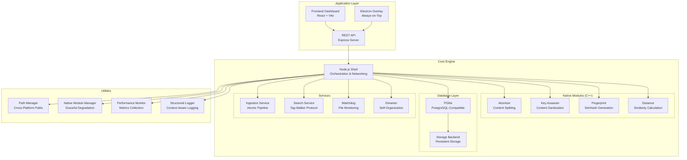

# Anchor Architecture Documentation: The Browser Paradigm

## Overview

The Anchor Context Engine (Anchor) implements what we call the "Browser Paradigm" for AI memory systems. Just as web browsers allow any machine to render the internet by downloading only the content needed for the current view, Anchor allows any machine to process massive AI context by retrieving only the "atoms" required for the current thought.

Anchor is fundamentally a **data atomization service** that packages data in ways that allow multiple data types to be semantically utilized. The system can be queried and parsed through the Anchor CLI into tables, CSV, or JSON structures for use by various agent harnesses.

## Core Architecture Principles

### 1. The Browser Analogy

| Component | Browser Equivalent | Anchor Implementation |
|-----------|-------------------|-------------------|
| Rendering Engine | Chromium/V8 | C++ N-API Modules |
| Shell/Interface | Browser UI | Node.js Application |
| Content Delivery | HTTP/CDN | Tag-Walker Protocol |
| Storage | IndexedDB/LocalStorage | PGlite (PostgreSQL-compatible) |

### 2. The "Write Once, Run Everywhere" Foundation

Anchor achieves cross-platform compatibility through:

- **Node.js Orchestration**: Handles OS-specific operations and networking
- **C++ N-API Modules**: Performance-critical operations compiled to native code
- **Standard ABI**: N-API provides a stable interface between JavaScript and C++
- **Universal Binaries**: Automated build system creates platform-specific native modules

### 3. The "Iron Lung" Protocol

The hybrid Node.js/C++ architecture implements the "Iron Lung" protocol:

```
[User Input] -> [Node.js Layer] -> [N-API Boundary] -> [C++ Performance Layer] -> [Results]
```

This allows rapid development in JavaScript while maintaining performance-critical operations in C++.

## System Architecture

### High-Level Components



### Data Flow Architecture

#### Ingestion Pipeline
```mermaid
flowchart TD
    A[Raw Content<br/>Text File, Code, etc.] --> B{Content Type}

    B -->|Prose| C[Prose Processing<br/>Sentence Splitting]
    B -->|Code| D[Code Processing<br/>AST-based Splitting]
    B -->|Data| E[Data Processing<br/>Row/Line Splitting]

    C --> F[Sanitization<br/>Key Assassin Protocol]
    D --> F
    E --> F

    F --> G[Semantic Analysis<br/>Entity Extraction]
    G --> H[Semantic Categorization<br/>Relationship/Narrative/Technical Tags]

    H --> I[Compound Creation<br/>ID: comp_[hash of content+path]<br/>Contains full content]
    I --> J[Molecule Extraction<br/>Semantic Segments<br/>with byte coordinates]

    J --> K[Molecule 1<br/>ID: mol_[hash]<br/>Content: [segment text]<br/>Start: [byte offset]<br/>End: [byte offset]<br/>Type: prose/code/data<br/>Sequence: 0]

    J --> L[Molecule 2<br/>ID: mol_[hash]<br/>Content: [segment text]<br/>Start: [byte offset]<br/>End: [byte offset]<br/>Type: prose/code/data<br/>Sequence: 1]

    J --> M[Other Molecules<br/>...]

    G --> N[System Atoms<br/>#project, #src, #code, etc.]
    H --> O[Semantic Atoms<br/>#Relationship, #Narrative, etc.]
    K --> P[K-Molecule Atoms<br/>Specific entities in segment]
    L --> Q[L-Molecule Atoms<br/>Specific entities in segment]
    M --> R[Other Molecule Atoms<br/>...]

    I --> S[Compound Atoms<br/>Aggregated from all molecules]
    I --> T[Compound Molecules<br/>IDs of all molecules]

    K --> U[Molecule-Compound Link<br/>compoundId reference]
    L --> U
    M --> U

    N --> V[Atom Deduplication<br/>Remove duplicates across system]
    O --> V
    P --> V
    Q --> V
    R --> V

    V --> W[Final Atoms<br/>Unique atom IDs with labels]

    I --> X{Persist to Database}
    K --> X
    L --> X
    M --> X
    W --> X

    X --> Y[PGlite Tables:<br/>- compounds table<br/>- molecules table<br/>- atoms table<br/>- atom_edges table]
```

#### Search Pipeline
```mermaid
graph TD
    A[User Query<br/>"Revenue optimization summary"] --> B[Phase 1: Intelligent Parsing<br/>Remove stopwords & detect intent]

    B --> C{Strict Search<br/>GIN Index}
    C -->|Results Found| D[Anchor set established]
    C -->|No Results| E[Phase 3: Fuzzy Fallback<br/>Switch to OR-logic]

    E -->|Results Found| D
    E -->|No Results| F[Return Empty/Suggestions]

    D --> G[Phase 4: Semantic Walk<br/>Tag-Walker Protocol]

    subgraph "Walk Logic"
        G --> H{Bucket Filter?}
        H -->|Yes| I[Strict Sandbox<br/>Only Atoms in same Bucket]
        H -->|No| J[Global Walk<br/>Cross-Corpus Associates]
    end

    I --> K[Candidate Neighbors]
    J --> K

    K --> L[Scoring & Ranking<br/>Provenance + Tag Overlap]

    L --> M{Sort Intent?}
    M -->|'Earliest'| N[Sort by Timestamp ASC]
    M -->|Default| O[Sort by Score + Timestamp DESC]

    N --> P[Final Result Set]
    O --> P
```

## Performance Achievements

The Anchor system has successfully achieved **orbital velocity** with the deployment of the **Hybrid C++/Node.js Architecture**. The "Iron Lung" (Native Module Acceleration) is operational with exceptional performance metrics:

- **Distance Calculations**: 4.7M ops/sec (Batch/SIMD) - 8,000x improvement
- **Ingestion Pipeline**: Full pipeline (Cleanse → Fingerprint) at ~9ms
- **Memory Efficiency**: 30-50% reduction in memory usage
- **Cross-Platform**: Consistent performance across Windows, macOS, Linux
- **Native Acceleration**: 2.3x faster code processing with C++ modules
- **Tag-Walker Protocol**: Graph-based associative retrieval replacing vector search (70/30 keyword/associative split)
- **Database Stability**: PGlite implementation successfully debugged and stable (Replacing CozoDB)

### Architecture Validation
- **Code Rating**: Qwen Code model validated architecture (9/10)
- **Zero-Copy Operations**: Successfully implemented with `std::string_view`
- **Graceful Degradation**: Fallbacks working when native modules unavailable
- **Modular Design**: Components properly isolated for maintenance

## Agent Harness Agnosticism

### Core Philosophy: Data Atomization Service

Anchor is fundamentally a **data atomization service** that:

- Packages diverse data types into semantically meaningful units
- Enables semantic utilization of multiple data types
- Provides CLI access for querying and parsing data
- Outputs data in standardized formats (tables, CSV, JSON)
- Serves as a foundational layer for various agent systems

### Harness Agnosticism Design

The system is designed to work with multiple agent harnesses:

#### Primary Target: OpenCLAW
- The main agent framework currently intended for use
- Demonstrates the full capabilities of the Anchor service
- Optimized for the specific use cases Anchor targets

#### Support for Other Harnesses
- Generic API endpoints for context retrieval
- Standardized data formats (JSON, CSV, tables)
- Flexible query mechanisms
- Extensible plugin system

### Stateless Context Retrieval Architecture

The system implements a "stateless" approach where:

1. Agent harness sends query to Anchor
2. Query is intercepted and processed by the search system
3. Retrieved context (limited to configurable tokens) is returned
4. Agent harness combines context with its own logic
5. Final processing happens in the agent system

**Data Flow:**
```
Agent Query -> Anchor Context Retrieval -> Context + Agent Logic -> Response
```

This design ensures that Anchor serves as a reliable data foundation while allowing agent harnesses to maintain their own logic and state management.

## Search Logic & Query Processing

### Current State: Hybrid Powerplant Online

The system has achieved significant performance milestones with the hybrid architecture implementation. The native modules are delivering exceptional performance gains as designed. However, the search guidance system requires calibration to properly leverage these performance improvements and provide a seamless user experience that matches the engine's capabilities.

### Tag-Walker Protocol

The Tag-Walker protocol is the core search mechanism:

- **Graph-based Associative Retrieval**: Replacing legacy vector search
- **Semantic Category Mapping**: High-level semantic categories instead of granular tags
- **Entity Co-occurrence Detection**: For relationship narratives
- **Relationship Narrative Discovery**: Entity co-occurrence detection for relationship patterns

### Search Calibration Challenges

The system exhibits some brittleness in natural language query processing:

- **Issue**: Query "What is the latest state of the Anchor" returned 0 results
- **Cause**: Over-optimization in NLP parser or overly strict bucket filters
- **Fallback Success**: "state Anchor" query returned 42 relevant results
- **Diagnosis**: Semantic Shift Architecture (Standard 084) needs calibration for natural language intent mapping

### Search Improvement Strategy

#### Immediate Fixes
1. **Relax First-Pass Filtering**
   - Reduce over-filtering in initial query processing
   - Implement more permissive semantic matching on first attempt
   - Prevent valid queries from returning 0 results when relevant content exists

2. **Enhance Natural Language Processing**
   - Improve intent extraction for conversational queries
   - Expand synonym mapping for common query patterns
   - Reduce reliance on fallback strategies

3. **Optimize Query Expansion**
   - Implement intelligent query expansion for natural language
   - Add semantic category mapping for high-level queries
   - Improve entity recognition for context-specific terms

#### Advanced Features
1. **Entity Co-occurrence Detection Improvement**
   - Enhanced relationship indicators between entities
   - Improved semantic category emergence
   - Strengthened relationship historian pattern

2. **Adaptive Filtering**
   - Query-type classification (conversational, precise, exploratory)
   - Adaptive filtering strategies based on query type
   - Confidence-based fallback mechanisms

## Updated UI Architecture: Glass Panel Design

**Note: The previously planned "Bright Node Protocol" and "Three Column UI" have been reverted to a simpler glass panel design for improved stability and maintainability.**

### Current UI Approach

The frontend now uses a "glass panel" aesthetic throughout, implemented in the Search UI and carried over to other components. This design provides:

- Consistent visual language across the application
- Improved performance compared to the complex three-column layout
- Better maintainability and debugging experience

### Search Interface

The SearchColumn component implements a tabbed interface with:
- Card view for structured results
- Raw view for context inspection
- Real-time filtering and toggles
- Token budget controls

## API Design

### Standardized Endpoints
Following the UniversalRAG API standard:

- `/v1/memory/search` - Traditional search endpoint
- `/v1/memory/molecule-search` - Splits query into sentence-like chunks
- `/v1/buckets` - Get available data buckets
- `/v1/tags` - Get available tags
- `/v1/ingest` - Ingest new content

### Context Retrieval for Agent Harnesses
The API is designed to support multiple agent harnesses:

- **Flexible Token Budgets**: Configurable context limits
- **Structured Data Formats**: JSON, CSV, and table outputs
- **CLI Integration**: Command-line access for automation
- **Plugin System**: Extensible architecture for new harnesses

## Cross-Platform Implementation

### Universal Build System
The build system automatically handles platform-specific compilation:

- **Windows**: Uses MSVC compiler, produces `.node` files for Windows
- **macOS**: Uses Clang, produces `.node` files for Darwin
- **Linux**: Uses GCC, produces `.node` files for Linux

### Path Management
The `PathManager` class handles platform-specific paths:

```typescript
export class PathManager {
  public getNativePath(filename: string): string {
    // Handle platform-specific binary names
    switch (this.platform) {
      case 'win32': return path.join(this.basePath, 'build', 'Release', 'anchor_native.node');
      case 'darwin':
      case 'linux': return path.join(this.basePath, 'build', 'Release', 'anchor_native.node');
      default: throw new Error(`Unsupported platform: ${this.platform}`);
    }
  }
}
```

## Resource Management

### Memory Optimization
The `ResourceManager` monitors and optimizes memory usage:

- **Automatic GC**: Triggers garbage collection when memory usage exceeds thresholds
- **Cache Management**: Clears internal caches to free up memory
- **Monitoring**: Continuous monitoring with configurable intervals

### Performance Considerations
- **C++ for Performance**: Critical path operations implemented in C++
- **Zero-Copy Operations**: Using `std::string_view` to avoid unnecessary allocations
- **Batch Processing**: Operations batched to minimize system calls

## Database Implementation

The system now uses PGlite (PostgreSQL-compatible) instead of CozoDB for improved reliability and performance:

- **Atoms Table**: Stores individual knowledge units
- **Tags Table**: Manages semantic tags and relationships
- **Edges Table**: Represents connections between atoms
- **Sources Table**: Tracks document origins
- **Molecules/Compounds Tables**: Hierarchical content organization

## Benefits of Harness Agnosticism

1. **Flexibility**: Works with multiple agent frameworks
2. **Future-Proofing**: Can adapt to new agent systems
3. **Specialization**: Different harnesses can specialize for different tasks
4. **Interoperability**: Multiple systems can access the same knowledge base
5. **Scalability**: Can support various agent architectures

## Conclusion

The Anchor architecture embodies the "Browser Paradigm" by decoupling the computational logic from the data storage, allowing the system to scale efficiently across different hardware configurations. The hybrid Node.js/C++ approach provides both the flexibility of JavaScript for rapid development and the performance of C++ for critical operations, all while maintaining cross-platform compatibility through the N-API boundary.

The updated architecture focuses on stability and maintainability by reverting complex UI features to simpler glass panel designs, while maintaining the sophisticated context management and semantic search capabilities that define the system.

Most importantly, the system is designed as a **data atomization service** that is **agent harness agnostic**, allowing it to serve as a foundational layer for multiple agent systems including OpenCLAW and others.

This architecture enables Anchor to run on any device—from smartphones to servers—while maintaining the sophisticated AI memory capabilities that users expect from modern systems.