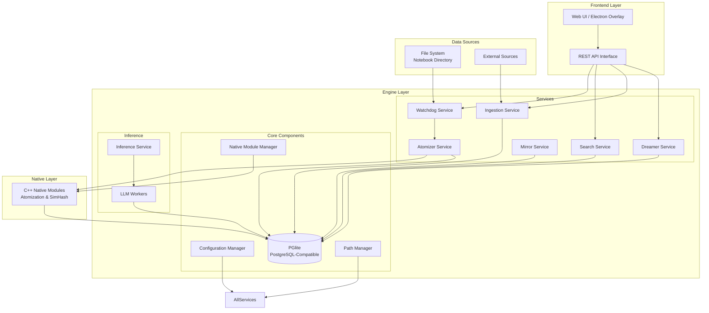
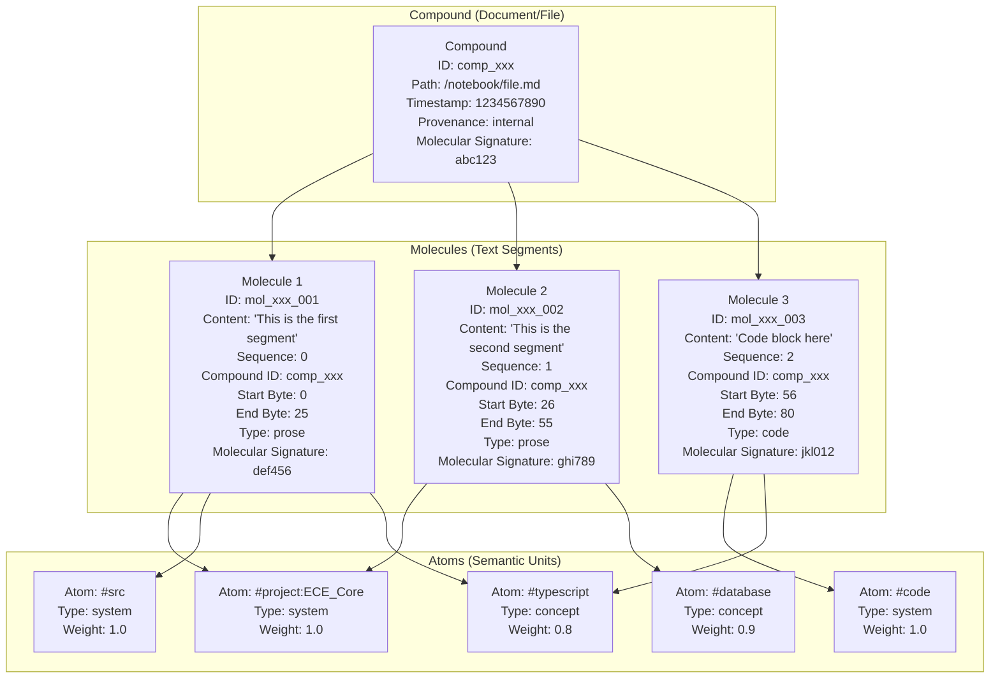
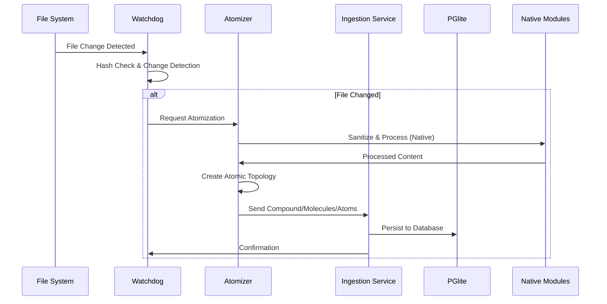

# ECE Architecture Diagrams

## System Architecture Overview



## Atomic Taxonomy: Atom -> Molecule -> Compound



## Ingestion Pipeline



## Search Architecture (Tag-Walker Protocol)

```mermaid
graph LR
    subgraph "Query Processing"
        QP[Query Parser<br/>NLP Processing]
        QE[Query Expander<br/>Tag Matching]
    end

    subgraph "Search Strategies"
        FTS[FTS Search<br/>PGlite GIN Index]
        TW[Tag-Walker<br/>Graph Traversal]
        EI[Engram Lookup<br/>O(1) Access]
    end

    subgraph "Results Processing"
        CI[Context Inflator<br/>Molecular Coordinates]
        RS[Result Scorer<br/>Provenance & Type Boosting]
        DF[Duplicate Filter<br/>SimHash Comparison]
    end

    subgraph "Database"
        TBL_MEM[(atoms table)]
        TBL_MOL[(molecules table)]
        TBL_ATOM[(tags table)]
        TBL_EDGE[(edges table)]
        TBL_ENG[(engrams table)]
    end

    QP --> QE
    QE --> FTS
    QE --> TW
    QE --> EI

    FTS --> TBL_MEM
    TW --> TBL_MEM
    TW --> TBL_ATOM
    TW --> TBL_EDGE
    EI --> TBL_ENG

    TBL_MEM --> CI
    TBL_MOL --> CI
    CI --> RS
    RS --> DF
```