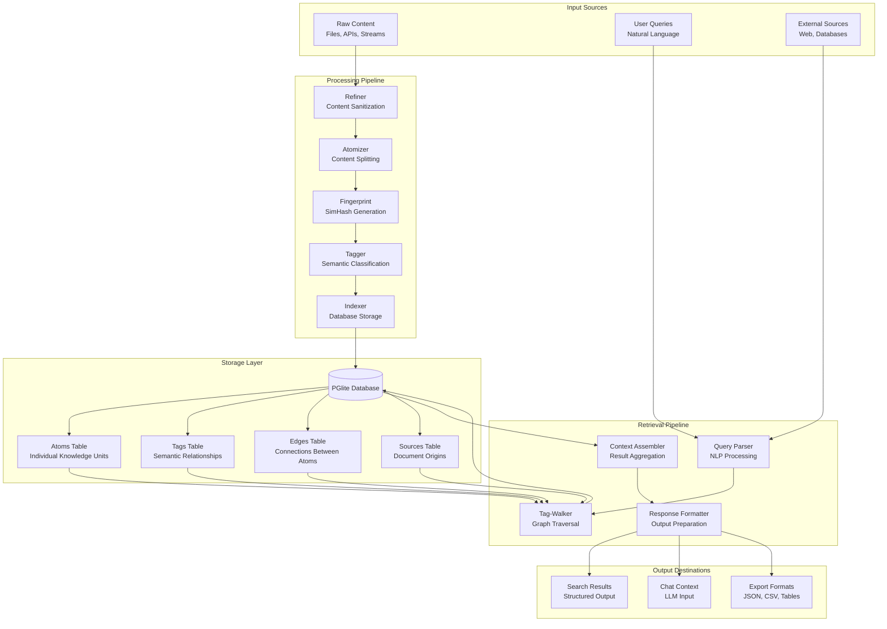
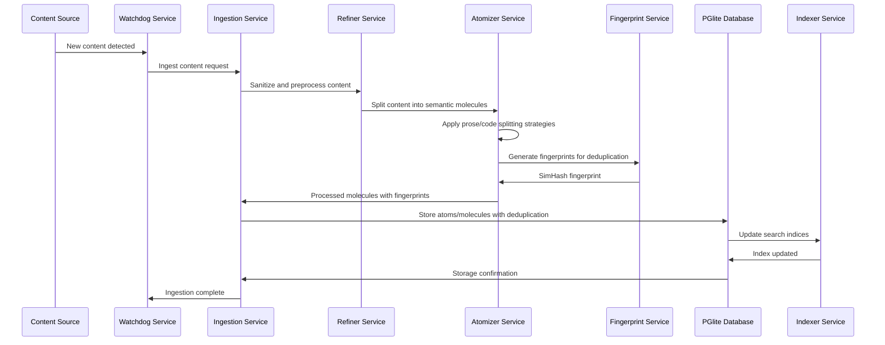
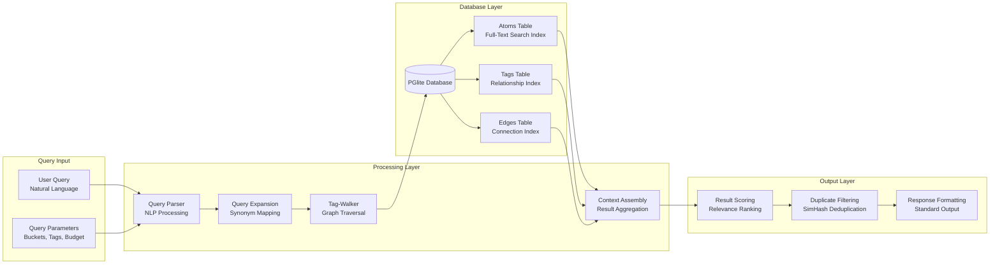
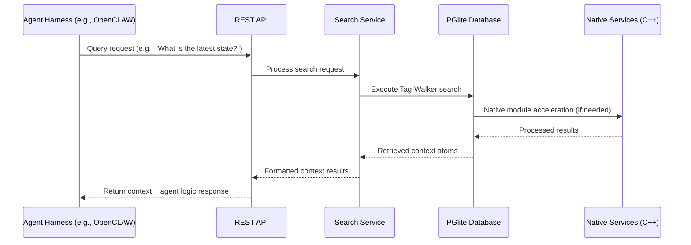

# Data Flow Diagram for ECE_Core

## High-Level Data Flow



## Atomic Architecture Flow

```mermaid
graph TD
    subgraph "Compound (Source Document)"
        CP[Compound<br/>ID: comp_[hash of path+content]<br/>Path: /context/notebook/file.md<br/>Timestamp: 1234567890<br/>Provenance: internal<br/>Molecular Signature: abc123def456]
    end

    subgraph "Molecules (Semantic Chunks)"
        M1[Molecule 1<br/>ID: mol_[hash of content]<br/>Content: 'This is the first paragraph'<br/>Compound ID: comp_[...]<br/>Sequence: 0<br/>Start Byte: 0<br/>End Byte: 25<br/>Type: prose<br/>Numeric Value: null<br/>Numeric Unit: null<br/>Molecular Signature: def456ghi789]
        
        M2[Molecule 2<br/>ID: mol_[hash of content]<br/>Content: 'const x = 5; // code example'<br/>Compound ID: comp_[...]<br/>Sequence: 1<br/>Start Byte: 26<br/>End Byte: 60<br/>Type: code<br/>Numeric Value: 5<br/>Numeric Unit: null<br/>Molecular Signature: ghi789jkl012]

        M3[Molecule 3<br/>ID: mol_[hash of content]<br/>Content: 'The results were 42.5 meters'<br/>Compound ID: comp_[...]<br/>Sequence: 2<br/>Start Byte: 61<br/>End Byte: 95<br/>Type: prose<br/>Numeric Value: 42.5<br/>Numeric Unit: meters<br/>Molecular Signature: jkl012mno345]
    end

    subgraph "Atoms (Semantic Units)"
        A1[Atom: #project:ECE_Core<br/>Type: system<br/>Weight: 1.0]
        A2[Atom: #src<br/>Type: system<br/>Weight: 1.0]
        A3[Atom: #code<br/>Type: system<br/>Weight: 1.0]
        A4[Atom: #typescript<br/>Type: concept<br/>Weight: 0.8]
        A5[Atom: #database<br/>Type: concept<br/>Weight: 0.9]
        A6[Atom: #numeric<br/>Type: measurement<br/>Weight: 0.7]
    end

    subgraph "Database Storage"
        X[(PGlite Database)]
        Y[Compounds Table<br/>- id<br/>- compound_body<br/>- path<br/>- timestamp<br/>- provenance<br/>- molecular_signature<br/>- atoms<br/>- molecules<br/>- embedding]
        
        Z[Molecules Table<br/>- id<br/>- content<br/>- compound_id<br/>- sequence<br/>- start_byte<br/>- end_byte<br/>- type<br/>- numeric_value<br/>- numeric_unit<br/>- molecular_signature<br/>- embedding<br/>- timestamp]
        
        AA[Atoms Table<br/>- id<br/>- content<br/>- source_path<br/>- source_id<br/>- sequence<br/>- type<br/>- hash<br/>- buckets<br/>- tags<br/>- epochs<br/>- provenance<br/>- simhash<br/>- embedding]
    end

    CP --> M1
    CP --> M2
    CP --> M3

    M1 --> A1
    M1 --> A2
    M1 --> A4
    M2 --> A3
    M2 --> A4
    M3 --> A5
    M3 --> A6

    CP --> Y
    M1 --> Z
    M2 --> Z
    M3 --> Z
    A1 --> AA
    A2 --> AA
    A3 --> AA
    A4 --> AA
    A5 --> AA
    A6 --> AA

    Y --> X
    Z --> X
    AA --> X
```

## Ingestion Data Flow



## Search Data Flow



## Agent Harness Integration Flow



## Backup/Restore Data Flow

```mermaid
graph TD
    subgraph "Backup Process"
        BA[Backup Request<br/>POST /v1/backup]
        BB[Database Export<br/>PGlite dump]
        BC[Compression<br/>ZIP/TAR packaging]
        BD[File Storage<br/>backups/ directory]
    end

    subgraph "Restore Process"
        BE[Restore Request<br/>POST /v1/backup/restore]
        BF[File Validation<br/>Checksum verification]
        BG[Decompression<br/>Extract backup archive]
        BH[Database Import<br/>PGlite restore]
        BI[Schema Validation<br/>Table structure check]
    end

    BA --> BB
    BB --> BC
    BC --> BD

    BE --> BF
    BF --> BG
    BG --> BH
    BH --> BI
```

