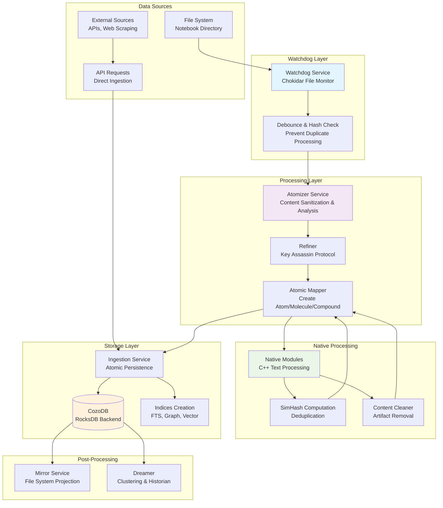
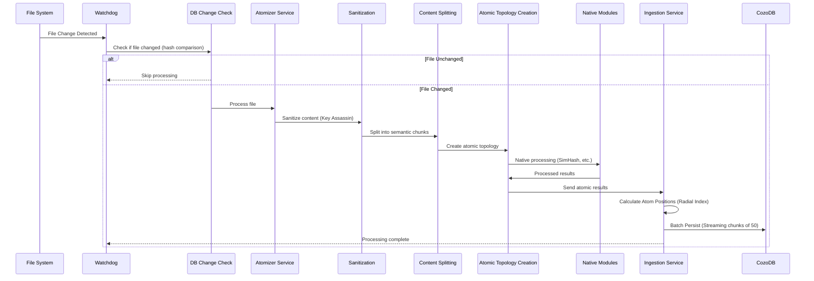
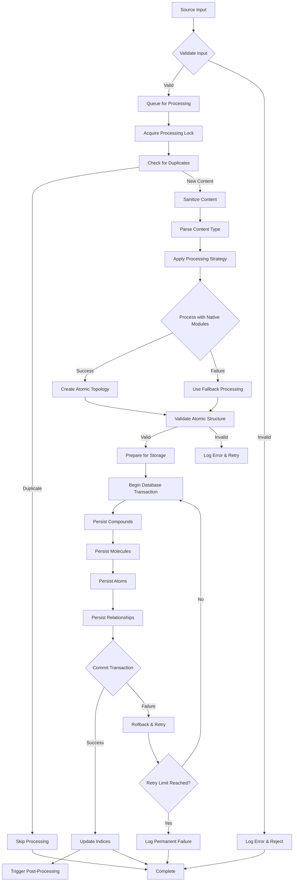
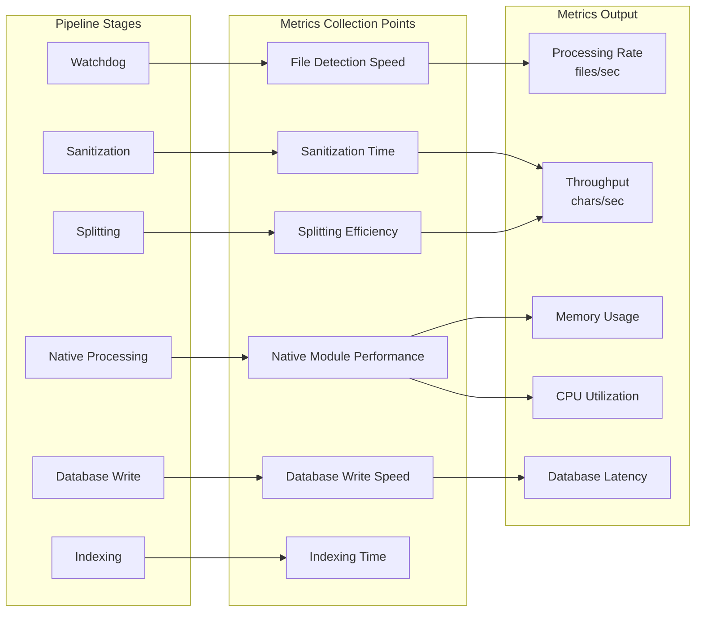

# ECE_Core Ingestion Pipeline

## Complete Ingestion Flow

```mermaid
graph TD
    subgraph "Data Sources"
        FS[File System<br/>Notebook Directory]
        EXT[External Sources<br/>APIs, Web Scraping]
        API[API Requests<br/>Direct Ingestion]
    end
    
    subgraph "Watchdog Layer"
        WD[Watchdog Service<br/>Chokidar File Monitor]
        DEBOUNCE[Debounce & Hash Check<br/>Prevent Duplicate Processing]
    end
    
    subgraph "Processing Layer"
        AS[Atomizer Service<br/>Content Sanitization & Analysis]
        REF[Refiner<br/>Key Assassin Protocol]
        AM[Atomic Mapper<br/>Create Atom/Molecule/Compound]
    end
    
    subgraph "Native Processing"
        NM[Native Modules<br/>C++ Text Processing]
        SH[SimHash Computation<br/>Deduplication]
        CL[Content Cleaner<br/>Artifact Removal]
    end
    
    subgraph "Storage Layer"
        IS[Ingestion Service<br/>Atomic Persistence]
        DB[(CozoDB<br/>RocksDB Backend)]
        IDX[Indices Creation<br/>FTS, Graph, Vector]
    end
    
    subgraph "Post-Processing"
        MS[Mirror Service<br/>File System Projection]
        DM[Dreamer<br/>Clustering & Historian]
    end
    
    FS --> WD
    EXT --> API
    API --> IS
    
    WD --> DEBOUNCE
    DEBOUNCE --> AS
    
    AS --> REF
    REF --> AM
    AM --> NM
    
    NM --> SH
    NM --> CL
    SH --> AM
    CL --> AM
    
    AM --> IS
    IS --> DB
    IS --> IDX
    
    DB --> MS
    DB --> DM
    
    style WD fill:#e1f5fe
    style AS fill:#f3e5f5
    style NM fill:#e8f5e8
    style DB fill:#fff3e0
```

## Detailed Processing Steps

```mermaid
sequenceDiagram
    participant FS as File System
    participant WD as Watchdog
    participant DB_CHK as DB Change Check
    participant AS as Atomizer Service
    participant SAN as Sanitization
    participant SPLIT as Content Splitting
    participant ATOM as Atomic Topology Creation
    participant NM as Native Modules
    participant IS as Ingestion Service
    participant DB as CozoDB
    
    FS->>WD: File Change Detected
    WD->>DB_CHK: Check if file changed (hash comparison)
    alt File Unchanged
        DB_CHK-->>WD: Skip processing
    else File Changed
        DB_CHK->>AS: Process file
        AS->>SAN: Sanitize content (Key Assassin)
        SAN->>SPLIT: Split into semantic chunks
        SPLIT->>ATOM: Create atomic topology
        ATOM->>NM: Native processing (SimHash, etc.)
        NM->>ATOM: Processed results
        ATOM->>IS: Send atomic results
        IS->>IS: Calculate Atom Positions (Radial Index)
        IS->>DB: Batch Persist (Streaming chunks of 50)
        IS-->>WD: Processing complete
    end
```

## Ingestion Pipeline with Error Handling

```mermaid
flowchart TD
    A[Source Input] --> B{Validate Input}
    
    B -->|Valid| C[Queue for Processing]
    B -->|Invalid| D[Log Error & Reject]
    
    C --> E[Acquire Processing Lock]
    E --> F[Check for Duplicates]
    
    F -->|Duplicate| G[Skip Processing]
    F -->|New Content| H[Sanitize Content]
    
    H --> I[Parse Content Type]
    I --> J[Apply Processing Strategy]
    
    J --> K{Process with Native Modules}
    K -->|Success| L[Create Atomic Topology]
    K -->|Failure| M[Use Fallback Processing]
    
    L --> N[Validate Atomic Structure]
    M --> N
    
    N -->|Valid| O[Prepare for Storage]
    N -->|Invalid| P[Log Error & Retry]
    
    O --> Q[Begin Database Transaction]
    Q --> R[Persist Compounds]
    R --> S[Persist Molecules]
    S --> T[Persist Atoms]
    T --> U[Persist Relationships]
    
    U --> V{Commit Transaction}
    V -->|Success| W[Update Indices]
    V -->|Failure| X[Rollback & Retry]
    
    W --> Y[Trigger Post-Processing]
    X --> Z{Retry Limit Reached?}
    
    Z -->|No| Q
    Z -->|Yes| AA[Log Permanent Failure]
    
    G --> BB[Release Resources]
    W --> BB
    AA --> BB
    D --> BB
    
    BB[Complete]
```

## Performance Metrics in Ingestion Pipeline

```mermaid
graph LR
    subgraph "Metrics Collection Points"
        MP1[File Detection Speed]
        MP2[Sanitization Time]
        MP3[Splitting Efficiency]
        MP4[Native Module Performance]
        MP5[Database Write Speed]
        MP6[Indexing Time]
    end
    
    subgraph "Pipeline Stages"
        S1[Watchdog]
        S2[Sanitization]
        S3[Splitting]
        S4[Native Processing]
        S5[Database Write]
        S6[Indexing]
    end
    
    subgraph "Metrics Output"
        MT1[Processing Rate<br/>files/sec]
        MT2[Throughput<br/>chars/sec]
        MT3[Memory Usage]
        MT4[CPU Utilization]
        MT5[Database Latency]
    end
    
    S1 --> MP1
    S2 --> MP2
    S3 --> MP3
    S4 --> MP4
    S5 --> MP5
    S6 --> MP6
    
    MP1 --> MT1
    MP2 --> MT2
    MP3 --> MT2
    MP4 --> MT3
    MP4 --> MT4
    MP5 --> MT5
```