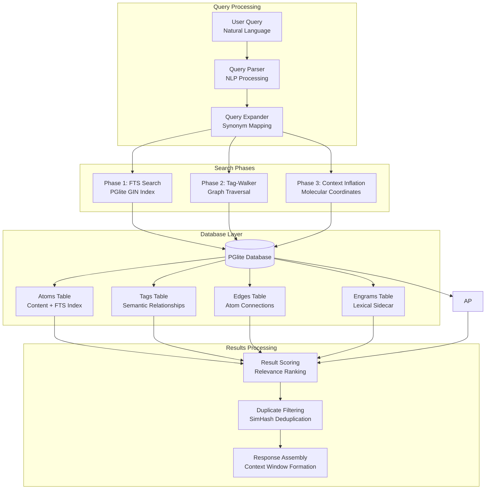
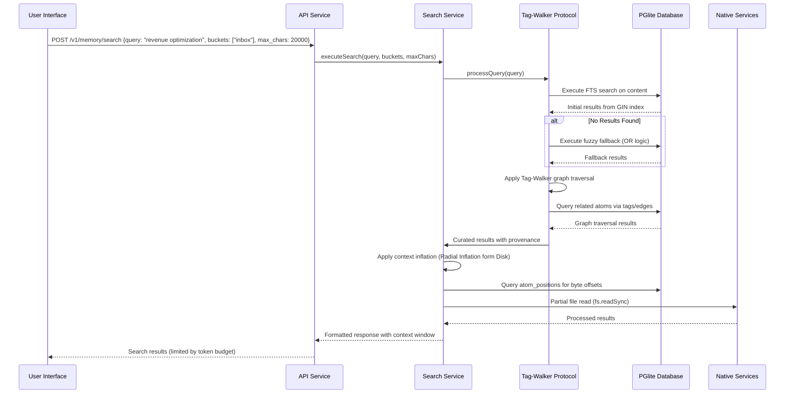
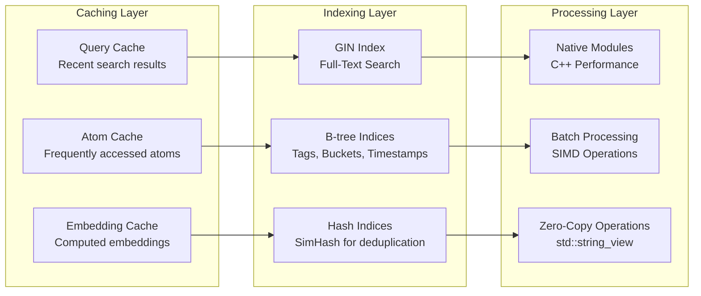
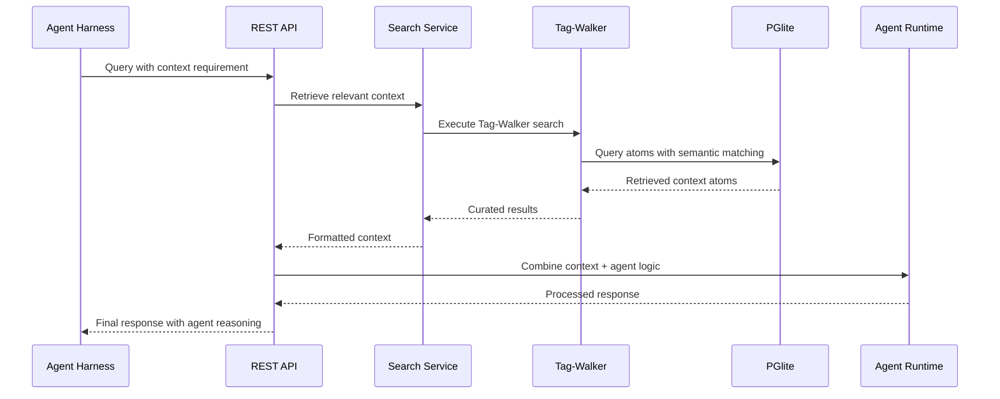

# Search Architecture Diagram for ECE_Core

## Tag-Walker Protocol Overview



## Detailed Search Flow



## Smart Search Protocol (Standard 094)

```mermaid
graph TD
    subgraph "Phase 1: Intelligent Parsing"
        A[Input: "What do we know about revenue optimization summary"]
        B[POS Tagging & Stopword Removal]
        C[Output: "revenue optimization summary"]
    end

    subgraph "Phase 2: Strict Anchor Search"
        D[GIN Index Query<br/>All terms must match]
        E[PGlite FTS with 'simple' dictionary]
        F[Strict AND logic: revenue & optimization & summary]
    end

    subgraph "Phase 3: Fuzzy Fallback"
        G[Trigger: Zero results from Phase 2]
        H[Logical OR query: revenue | optimization | summary]
        I[Retrieve partial matches]
    end

    subgraph "Phase 4: Semantic Walk"
        J[Use seed results as graph nodes]
        K[Traverse related atoms via shared tags]
        L[Pull in associated content]
    end

    A --> B
    B --> C
    C --> D
    D --> E
    E --> F
    F -->|Zero Results| G
    G --> H
    H --> I
    F -->|Results Found| J
    I -->|Results Found| J
    J --> K
    K --> L
```

## Performance Optimization Layers



## Agent Integration Search Flow



## Database Schema for Search

```mermaid
graph BT
    subgraph "PGlite Tables"
        AT[Atoms Table<br/>- id (TEXT)<br/>- content (TEXT)<br/>- source_path (TEXT)<br/>- timestamp (REAL)<br/>- buckets (TEXT[])<br/>- tags (TEXT[])<br/>- epochs (TEXT[])<br/>- simhash (TEXT)<br/>- embedding (TEXT)<br/>- provenance (TEXT)<br/>- payload (JSONB)]
        
        TT[Tags Table<br/>- atom_id (TEXT)<br/>- tag (TEXT)<br/>- bucket (TEXT)<br/>PRIMARY KEY (atom_id, tag)]
        
        ET[Edges Table<br/>- source_id (TEXT)<br/>- target_id (TEXT)<br/>- relation (TEXT)<br/>- weight (REAL)<br/>PRIMARY KEY (source_id, target_id, relation)]
        
        ST[Sources Table<br/>- path (TEXT)<br/>- hash (TEXT)<br/>- total_atoms (INTEGER)<br/>- last_ingest (REAL)<br/>PRIMARY KEY (path)]
        
        MT[Molecules Table<br/>- id (TEXT)<br/>- content (TEXT)<br/>- compound_id (TEXT)<br/>- sequence (INTEGER)<br/>- start_byte (INTEGER)<br/>- end_byte (INTEGER)<br/>- type (TEXT)<br/>- numeric_value (REAL)<br/>- numeric_unit (TEXT)<br/>- molecular_signature (TEXT)<br/>- embedding (TEXT)<br/>- timestamp (REAL)]
        
        CT[Compounds Table<br/>- id (TEXT)<br/>- compound_body (TEXT)<br/>- path (TEXT)<br/>- timestamp (REAL)<br/>- provenance (TEXT)<br/>- molecular_signature (TEXT)<br/>- atoms (TEXT)<br/>- molecules (TEXT)<br/>- embedding (TEXT)<br/>PRIMARY KEY (id)]

        AP[Atom Positions Table<br/>- compound_id (TEXT)<br/>- atom_label (TEXT)<br/>- byte_offset (INTEGER)<br/>PRIMARY KEY (compound_id, atom_label, byte_offset)]
    end

    AT -.-> TT
    AT -.-> ET
    AT -.-> ST
    AT -.-> MT
    AT -.-> CT
    AT -.-> AP
```