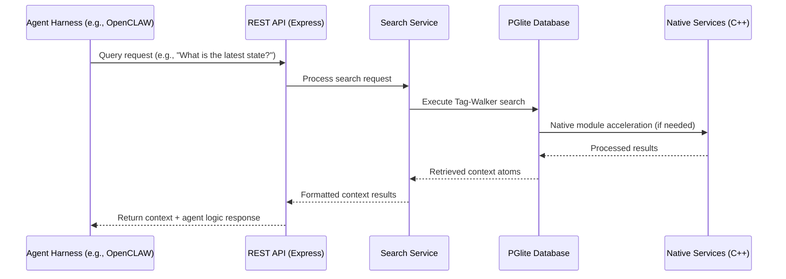
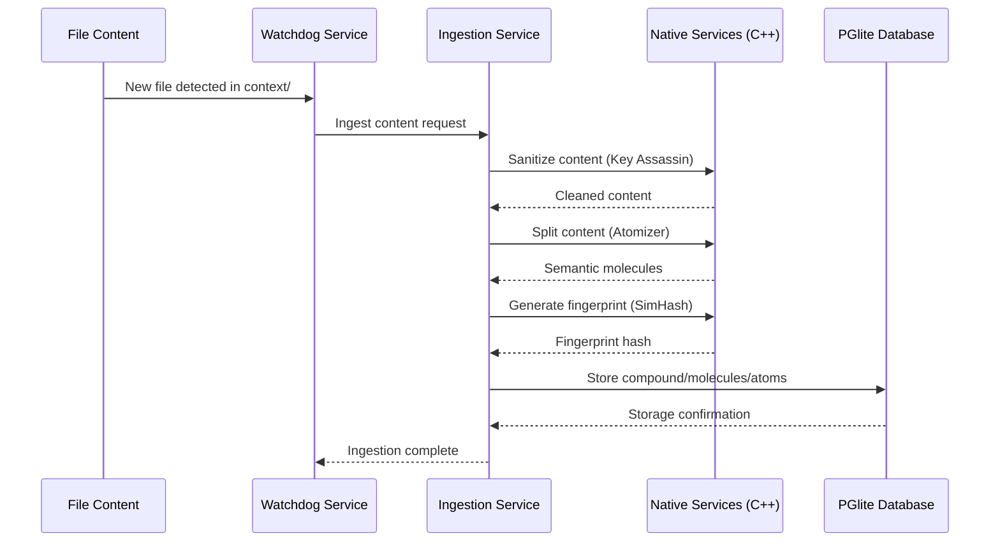
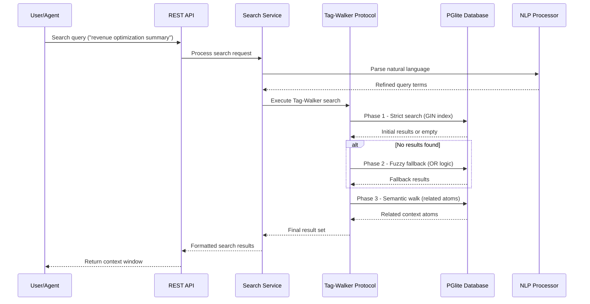
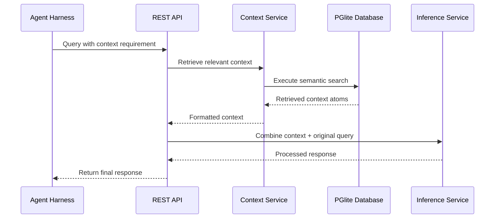
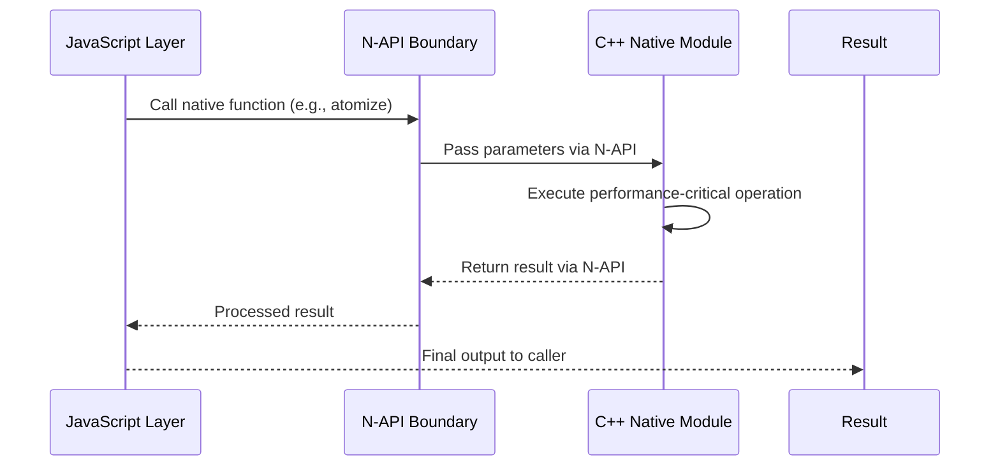

# Sequence Diagrams for ECE_Core

## 1. Agent Harness Integration Sequence



## 2. Data Ingestion Sequence



## 3. Search Workflow Sequence



## 4. Stateless Context Retrieval Sequence



## 5. Native Module Integration Sequence



## 6. Server Startup Sequence (Standard 088 Compliant)

```mermaid
sequenceDiagram
    participant INIT as Initialization
    participant SRV as HTTP Server
    participant DB as Database
    participant SVC as Services
    
    INIT->>SRV: Start HTTP server
    SRV-->>INIT: Server listening on port
    INIT->>DB: Initialize database (background)
    DB-->>INIT: Database ready notification
    INIT->>SVC: Initialize services
    SVC-->>INIT: Services ready
    Note over SRV,DB,SVC: Server available during DB initialization
```