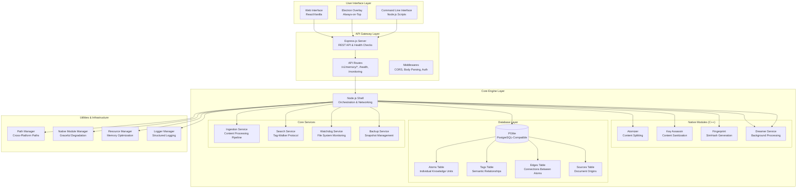
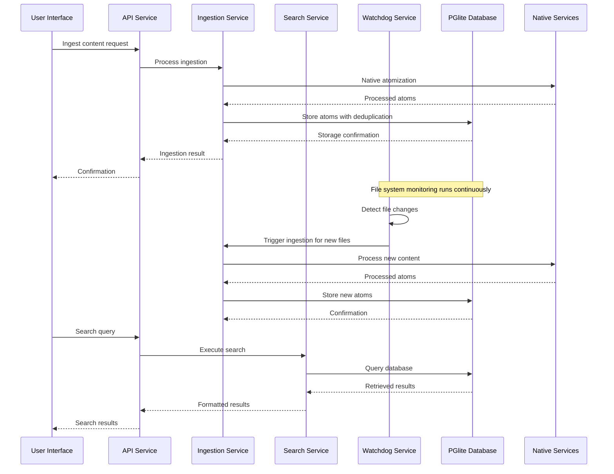
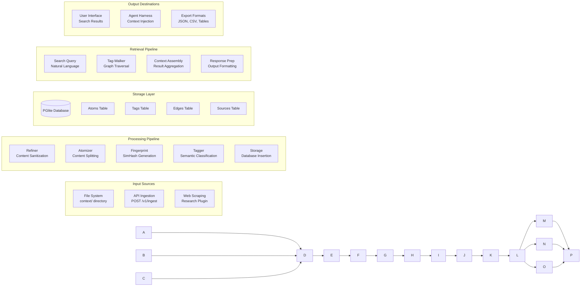
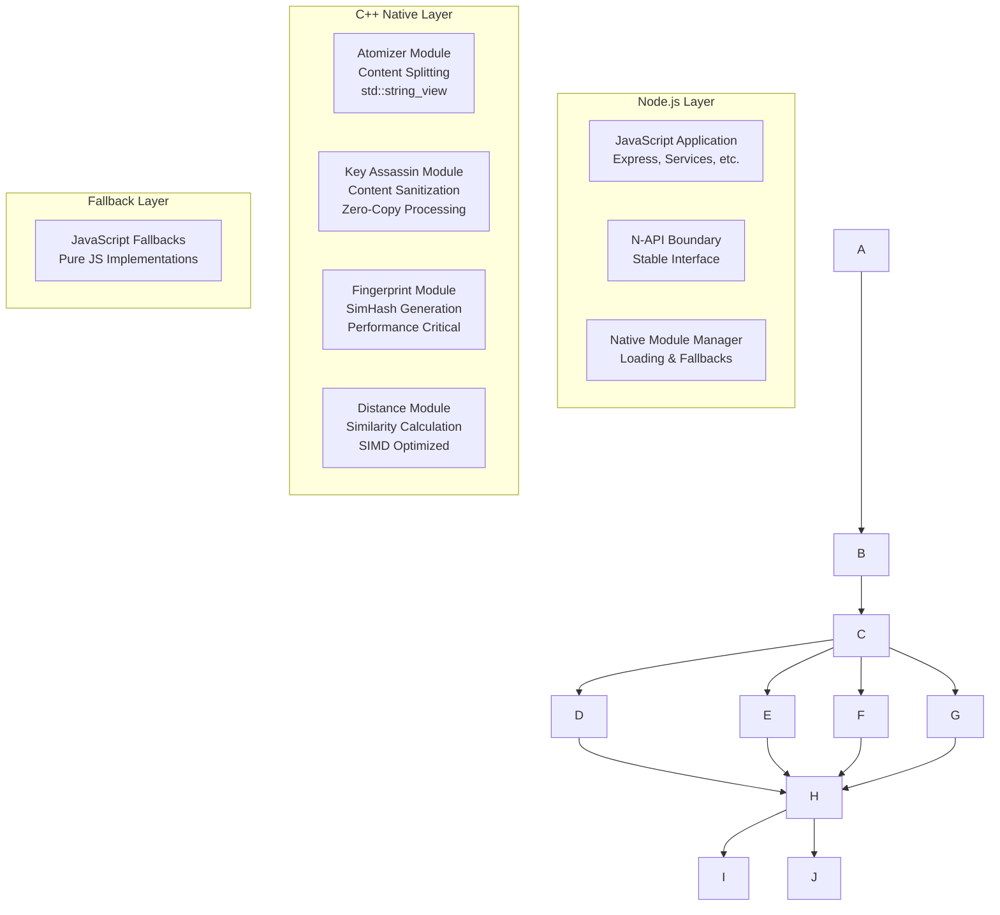
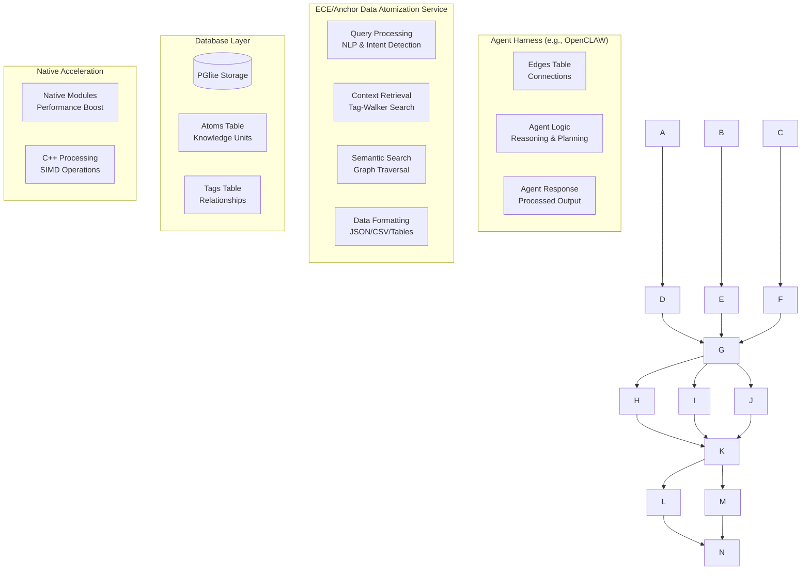

# System Components Diagram for ECE_Core

## High-Level Architecture



## Service Interaction Flow



## Data Flow Architecture



## Native Module Integration



## Agent Harness Integration Architecture



## Monitoring & Health Architecture

```mermaid
graph LR
    subgraph "Health Monitoring"
        HA[Health API<br/>GET /health]
        HB[Component Status<br/>Database, Services, etc.]
        HC[Performance Metrics<br/>Response Times, Memory]
        HD[Resource Utilization<br/>CPU, Disk, Network]
    end

    subgraph "Monitoring Endpoints"
        ME[/monitoring/metrics<br/>Prometheus Format]
        ML[/monitoring/logs<br/>Recent Log Entries]
        MC[/monitoring/components<br/>Detailed Status]
        MR[/monitoring/resources<br/>System Resources]
    end

    subgraph "Alerting & Notifications"
        AA[Anomaly Detection<br/>Performance Thresholds]
        AB[Error Tracking<br/>Exception Monitoring]
        AC[Resource Alerts<br/>Memory, Disk Space]
        AD[Service Degradation<br/>Component Failures]
    end

    A --> E
    B --> F
    C --> G
    D --> H
    E --> I
    F --> I
    G --> I
    H --> I
    I --> J
    I --> K
    I --> L
    I --> M
    J --> N
    K --> N
    L --> N
    M --> N
```