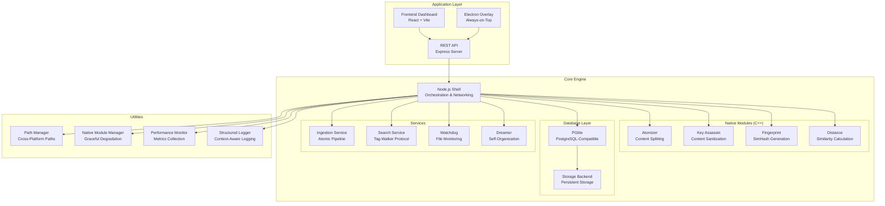
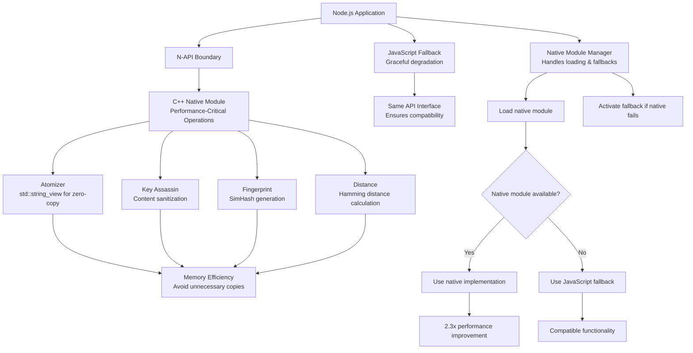
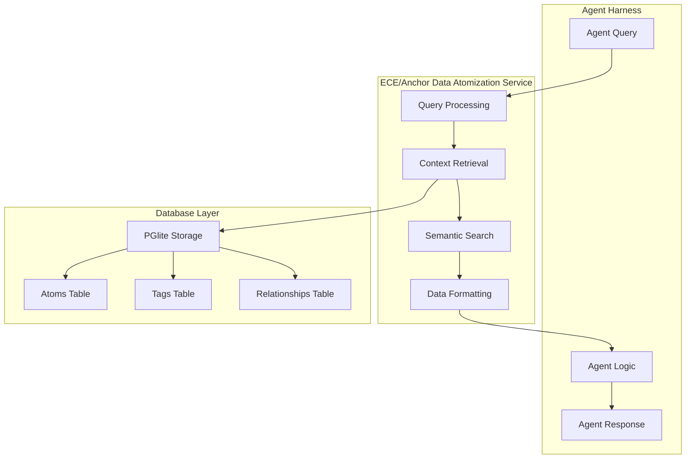
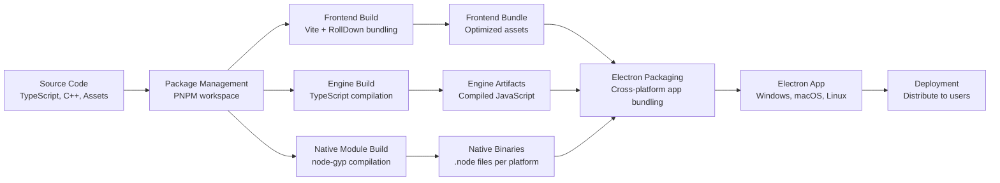

# ECE_Core Architecture Diagrams

## 1. Overall System Architecture



## 2. Atomic Architecture Flow

```mermaid
flowchart TD
    A[Raw Content<br/>Text File, Code, etc.] --> B{Content Type}

    B -->|Prose| C[Prose Processing<br/>Sentence Splitting]
    B -->|Code| D[Code Processing<br/>AST-based Splitting]
    B -->|Data| E[Data Processing<br/>Row/Line Splitting]

    C --> F[Sanitization<br/>Key Assassin Protocol]
    D --> F
    E --> F

    F --> G[Semantic Analysis<br/>Entity Extraction]
    G --> H[Semantic Categorization<br/>Relationship/Narrative/Technical Tags]

    H --> I[Compound Creation<br/>ID: comp_[hash of content+path]<br/>Contains full content]
    I --> J[Molecule Extraction<br/>Semantic Segments<br/>with byte coordinates]

    J --> K[Molecule 1<br/>ID: mol_[hash]<br/>Content: [segment text]<br/>Start: [byte offset]<br/>End: [byte offset]<br/>Type: prose/code/data<br/>Sequence: 0]

    J --> L[Molecule 2<br/>ID: mol_[hash]<br/>Content: [segment text]<br/>Start: [byte offset]<br/>End: [byte offset]<br/>Type: prose/code/data<br/>Sequence: 1]

    J --> M[Other Molecules<br/>...]

    G --> N[System Atoms<br/>#project, #src, #code, etc.]
    H --> O[Semantic Atoms<br/>#Relationship, #Narrative, etc.]
    K --> P[K-Molecule Atoms<br/>Specific entities in segment]
    L --> Q[L-Molecule Atoms<br/>Specific entities in segment]
    M --> R[Other Molecule Atoms<br/>...]

    I --> S[Compound Atoms<br/>Aggregated from all molecules]
    I --> T[Compound Molecules<br/>IDs of all molecules]

    K --> U[Molecule-Compound Link<br/>compoundId reference]
    L --> U
    M --> U

    N --> V[Atom Deduplication<br/>Remove duplicates across system]
    O --> V
    P --> V
    Q --> V
    R --> V

    V --> W[Final Atoms<br/>Unique atom IDs with labels]

    I --> X{Persist to Database}
    K --> X
    L --> X
    M --> X
    W --> X

    X --> Y[PGlite Tables:<br/>- compounds table<br/>- molecules table<br/>- atoms table<br/>- atom_edges table]
```

## 3. Tag-Walker Search Protocol

```mermaid
graph TD
    A[User Query<br/>"Revenue optimization summary"] --> B[Phase 1: Intelligent Parsing<br/>Remove stopwords & detect intent]

    B --> C{Strict Search<br/>GIN Index}
    C -->|Results Found| D[Anchor set established]
    C -->|No Results| E[Phase 3: Fuzzy Fallback<br/>Switch to OR-logic]

    E -->|Results Found| D
    E -->|No Results| F[Return Empty/Suggestions]

    D --> G[Phase 4: Semantic Walk<br/>Tag-Walker Protocol]

    subgraph "Walk Logic"
        G --> H{Bucket Filter?}
        H -->|Yes| I[Strict Sandbox<br/>Only Atoms in same Bucket]
        H -->|No| J[Global Walk<br/>Cross-Corpus Associates]
    end

    I --> K[Candidate Neighbors]
    J --> K

    K --> L[Scoring & Ranking<br/>Provenance + Tag Overlap]

    L --> M{Sort Intent?}
    M -->|'Earliest'| N[Sort by Timestamp ASC]
    M -->|Default| O[Sort by Score + Timestamp DESC]

    N --> P[Final Result Set]
    O --> P
```

## 4. Native Module Integration



## 5. Agent Harness Integration



## 6. Build & Deployment Pipeline

