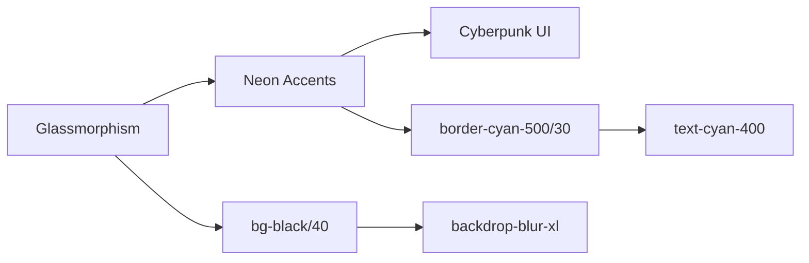

# Standard 077: Unified Visual Engine (Tailwind Integration)

**Category:** UI / Frontend
**Status:** Active
**Date:** 2026-01-27

## 1. Philosophy
The "Visual Engine" transition converts the legacy CSS-variable-only system into a hybrid **Tailwind CSS v3** architecture. This enables rapid prototyping of "Cyberpunk" aesthetics (glows, glassmorphism) while maintaining standard atomic structures.

## 2. Dependency Lock (Standard 077.1)
Due to breaking changes in Tailwind CSS v4, the project is LOCKED to **v3.4.17**. 
- **Required DevDeps**: `tailwindcss@3.4.17`, `postcss`, `autoprefixer`.
- **Reasoning**: v4 removes `tailwind.config.js` and requires `@tailwindcss/postcss`, which conflicts with the current PostCSS/Vite build pipeline on Windows.

## 3. Aesthetic Standards

## 4. R1 Reasoning Loop (Standard 077.2)
The chat interface implements the **R1 Reasoning Loop**, providing a multi-stage cognitive process before the final answer.

```mermaid
graph TD
    P[User Prompt] --> T1[Thought 1: Initial Analysis]
    T1 --> T2[Thought 2: Evaluation]
    T2 --> T3[Thought 3: Assessment]
    T3 --> A[Final Answer]
    style T1 fill:#083344,stroke:#06b6d4
    style T2 fill:#083344,stroke:#06b6d4
    style T3 fill:#083344,stroke:#06b6d4
    style A fill:#064e3b,stroke:#10b981
```

## 5. Architecture Principle: Headless Kernel, Browser Face

The Visual Engine is **decoupled** from the runtime kernel.

- **The Host**: The ECE Engine runs as a headless process (Service/Tray).
- **The Interface**: The UI is served as a React SPA via the configured server URL (default: `localhost:3160`, configurable in user_settings.json).
- **Rationale**: Browser engines (Chrome/Edge) offer superior performance, extension support, and stability compared to embedding a heavyweight webview for a single-page app.

## 6. Layout & Composition
The system prioritizes a **Focused Single-Column Layout** for specialized routes (e.g., `#chat`). 
- **Main Container**: Leveraging the `GlassPanel` atomic component with standard margins and high-fidelity glassmorphism.
- **Composition**: Interfaces should be simple and focused, avoiding multi-column clutter unless explicitly required for data-heavy views (like `#search`).
- **Styling**: Mixing Tailwind utilities for micro-styling with standard CSS variables for theme consistency across the `three-column` and `simplified` paradigms.
