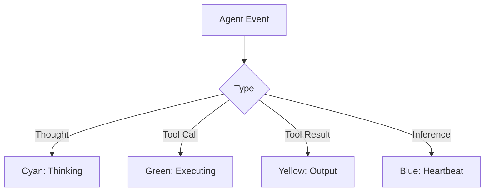

# Standard 078: Process Isolation & Live Diagnostics

**Category:** DevOps / Diagnostics
**Status:** Active
**Date:** 2026-01-27

## 1. Philosophy
Live thinking logs are essential for agent transparency. Internal agent events (thoughts, tool calls) must be visible in the terminal session that launched the process.

## 2. Process Lifecycle (Standard 078.1)
Launch scripts (`start.bat`, `start.sh`) must ensure only ONE engine instance exists per port.
- **Action**: Check port 3000 for listeners.
- **Action**: Terminate any process holding the port before spawning a new instance.
- **Benefit**: Ensures the current shell inherits the child's `stdout`, preventing "Hidden Logs" in background sessions.

## 3. Logging Standards

- **Constraint**: Use standard ANSI escape codes for cross-platform terminal color support.
