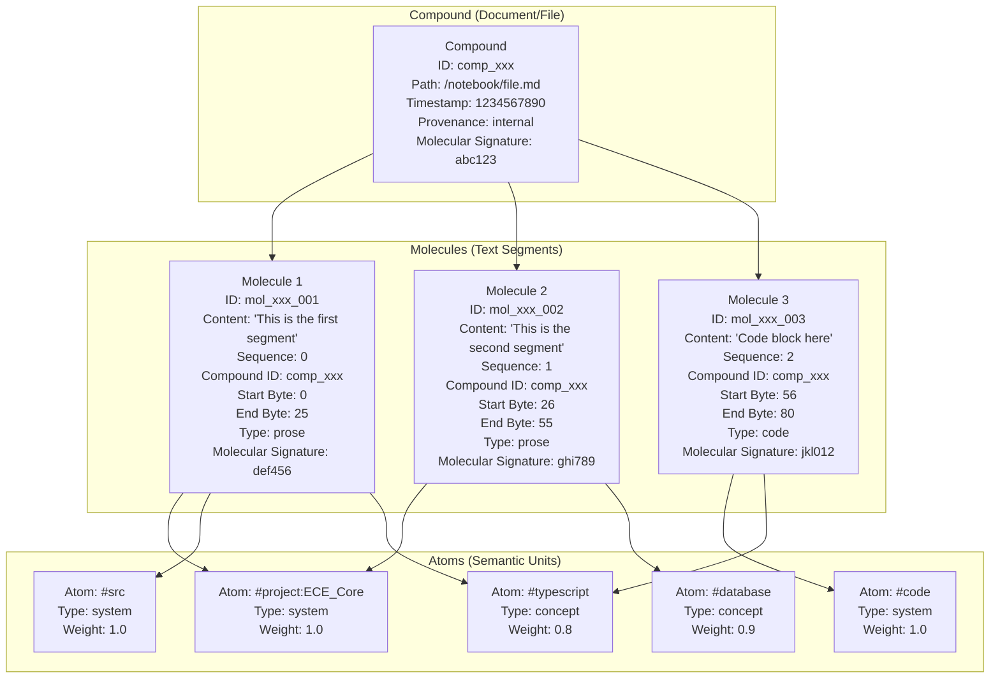

# Atomic Taxonomy (V4) & Universal Data API

**Status:** Active | **Authority:** System Core

## 1. Abstract
This standard defines the **Atomic Taxonomy** (V4), replacing the legacy Chunk-based data topology with a granular structure comprising **Compounds**, **Molecules**, and **Atoms**. This shift enables the **Universal Data API**, allowing for precise, sentence-level retrieval and manipulation of enhanced context.

## 2. The Atomic Taxonomy
Data is no longer stored as arbitrary "chunks" but as structured chemical entities.

### 2.1 Compounds (Type: `file`)
*   **Definition:** The storable substance. Equivalent to a file or a complete document.
*   **Role:** The container for all constituent elements.
*   **Properties:**
    *   `compound_body`: The full text content.
    *   `molecular_signature`: SimHash of the entire content (for file-level deduplication).
    *   `path`: File path for provenance tracking.
    *   `timestamp`: Creation/modification time.
    *   `provenance`: Source classification ('internal', 'external', 'quarantine').
    *   `molecules`: Array of molecule IDs contained in this compound.
    *   `atoms`: Array of atom IDs aggregated from all molecules.

### 2.2 Molecules (Type: `fragment`)
*   **Definition:** The logical arrangement of atoms. Equivalent to a **sentence** or a discrete thought.
*   **Role:** The fundamental unit of retrieval (`Universal Data API`).
*   **Properties:**
    *   `content`: The sentence text.
    *   `sequence`: Positional index within the Compound.
    *   `compound_id`: Reference to parent compound.
    *   `start_byte`: Starting byte position in the compound.
    *   `end_byte`: Ending byte position in the compound.
    *   `type`: Content type ('prose', 'code', 'data').
    *   `numeric_value`: Optional numeric value for data molecules.
    *   `numeric_unit`: Optional unit for numeric values.
    *   `molecular_signature`: SimHash for deduplication.
    *   `atoms`: Array of atom IDs present in this molecule.
*   **Granularity:** Retrieval targets Molecules, not Compounds. This reduces context window pollution (e.g., retrieving just the relevant function definition, not the whole file).

### 2.3 Atoms (Type: `concept`)
*   **Definition:** The fundamental unit of meaning. Equivalent to a keyword, entity, or tag.
*   **Role:** The connective tissue (Edges/Vertices) that links Molecules.
*   **Properties:**
    *   `label`: The semantic value (e.g., `#Project:ECE`, `#SimHash`).
    *   `type`: Classification ('concept', 'entity', 'keyword', 'system').
    *   `weight`: Importance score (0-1).
    *   `embedding`: Optional semantic vector representation.

## 2.4 Visual Representation



## 3. The Universal Data API
By storing data as Molecules, we unlock a "Universal Data API."

*   **Query:** "How does SimHash work?"
*   **Legacy Result:** Returns the entire `refiner.ts` file (2000 lines).
*   **Universal API Result:** Returns 3 specific Molecules (Sentences) from `refiner.ts` that explain SimHash, plus 2 Molecules from `README.md`.
*   **Benefit:**
    *   **High Signal/Noise Ratio:** 95%+ relevant content in context window.
    *   **Precision:** exact answers without hallucination.

## 4. Migration Guide (Legacy to V4)
*   **Refiner** → **AtomizerService**
*   **SimHash** → **Molecular Signature**
*   **Chunk** → **Molecule**

## 5. Persistence Strategy
*   **Table `compounds`**: Stores full file bodies (for reconstruction).
*   **Table `molecules`** (formerly `memory` fragment rows): Stores searchable sentences with byte coordinates.
*   **Table `atoms`**: Stores global entities.
*   **Table `atom_edges`**: Stores relationships between atoms and molecules.

## 6. Processing Flow

```mermaid
flowchart TD
    A[Raw Content<br/>Text File, Code, etc.] --> B{Content Type}

    B -->|Prose| C[Prose Processing<br/>Sentence Splitting]
    B -->|Code| D[Code Processing<br/>AST-based Splitting]
    B -->|Data| E[Data Processing<br/>Row/Line Splitting]

    C --> F[Sanitization<br/>Key Assassin Protocol]
    D --> F
    E --> F

    F --> G[Semantic Analysis<br/>Entity Extraction]
    G --> H[Semantic Categorization<br/>Relationship/Narrative/Technical Tags]

    H --> I[Compound Creation<br/>ID: comp_[hash of content+path]<br/>Contains full content])
    I --> J[Molecule Extraction<br/>Semantic Segments<br/>with byte coordinates]

    J --> K[Molecule 1<br/>ID: mol_[hash]<br/>Content: [segment text]<br/>Start: [byte offset]<br/>End: [byte offset]<br/>Type: prose/code/data<br/>Sequence: 0]

    J --> L[Molecule 2<br/>ID: mol_[hash]<br/>Content: [segment text]<br/>Start: [byte offset]<br/>End: [byte offset]<br/>Type: prose/code/data<br/>Sequence: 1]

    J --> M[Other Molecules<br/>...]

    G --> N[System Atoms<br/>#project, #src, #code, etc.]
    H --> O[Semantic Atoms<br/>#Relationship, #Narrative, etc.]
    K --> P[K-Molecule Atoms<br/>Specific entities in segment]
    L --> Q[L-Molecule Atoms<br/>Specific entities in segment]
    M --> R[Other Molecule Atoms<br/>...]

    I --> S[Compound Atoms<br/>Aggregated from all molecules]
    I --> T[Compound Molecules<br/>IDs of all molecules]

    K --> U[Molecule-Compound Link<br/>compoundId reference]
    L --> U
    M --> U

    N --> V[Atom Deduplication<br/>Remove duplicates across system])
    O --> V
    P --> V
    Q --> V
    R --> V

    V --> W[Final Atoms<br/>Unique atom IDs with labels])

    I --> X{Persist to Database}
    K --> X
    L --> X
    M --> X
    W --> X

    X --> Y[CozoDB Tables:<br/>- compounds table<br/>- molecules table<br/>- atoms table<br/>- atom_edges table]
```

## 7. Semantic Category System (Standard 084 Integration)
The atomic taxonomy integrates with the semantic category system from Standard 084:

*   **Relationship Category**: Applied when 2+ person entities appear in the same molecule
*   **Narrative Category**: Applied when person + time reference appear in the same molecule
*   **Technical Category**: Applied when technical terms appear in the same molecule
*   **Location Category**: Applied when location references appear in the same molecule
*   **Industry Category**: Applied when industry-specific terms appear
*   **Emotional Category**: Applied when high sentiment variance content is detected
*   **Temporal Category**: Applied when time-based sequences are present
*   **Causal Category**: Applied when cause-effect relationships are identified

## 8. Entity Co-occurrence Detection
The system implements "Tag Emergence" where semantic tags emerge from the interaction of entities within semantic molecules:

- **Relationship Detection**: When 2+ person entities appear in the same molecule → `#Relationship` tag
- **Narrative Detection**: When person + time reference appear → `#Narrative` tag
- **Technical Detection**: When technical terms appear → `#Technical` tag
- **Location Detection**: When location references appear → `#Location` tag

## 9. Relationship Narrative Discovery
The system can identify relationship patterns by detecting when entities appear together:

```
Input: "Rob and Jade went to the park yesterday"
Process:
  - Detect entities: ["Rob", "Jade"]
  - Detect relationship indicator: "and"
  - Detect time reference: "yesterday"
  - Apply tags: #Relationship, #Narrative
Output: Molecule tagged with relationship and narrative semantics
```

## 10. Universal Application
The same architecture works across domains:
- **Personal Domain**: Alice/Bob relationship narratives
- **Industrial Domain**: CO2/Sequestration/Oil industry relationships
- **Technical Domain**: Code component relationships
- **Research Domain**: Academic concept relationships