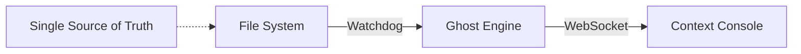

# Standard 023: Anchor Lite Architecture

## 1. What Happened
The system became overly complex with multiple database views (DB Builder, Memory Builder) and experimental chat interfaces, causing data synchronization issues and user confusion.

## 2. The Cost
- Loss of trust in retrieval ("Jade" not found).
- High maintenance overhead.

## 3. The Rule
**Single Pipeline Architecture:**

1. **Source:** File System (`context/` folder) is the Single Source of Truth.
2. **Ingest:** `watchdog.py` monitors files and pushes to the Engine.
3. **Index:** `ghost.html` (Headless CozoDB) maintains the index.
4. **Retrieve:** `context.html` is the sole interface for search.
